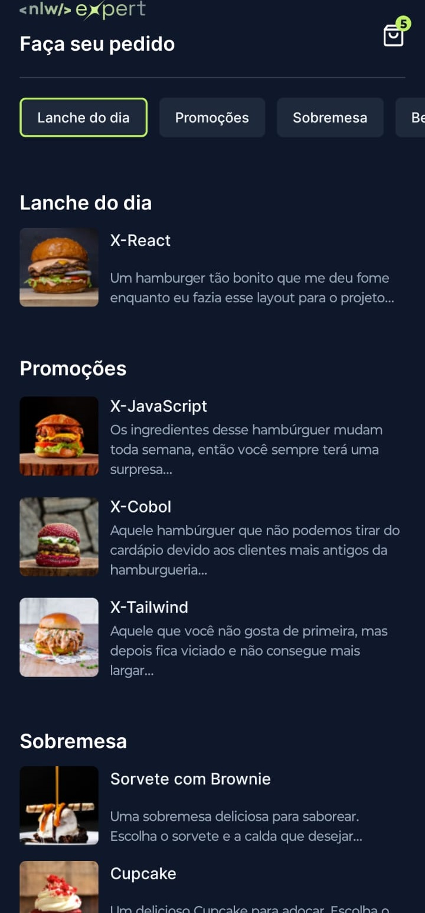

# MenuApp



## Descrição

O MenuApp é um aplicativo desenvolvido durante as aulas da Rocketseat no evento NLW Expert. Ele permite que os usuários façam pedidos de comida de forma simples para restaurantes locais.

## Funcionalidades Principais

- **Visualização de Cardápio:** Os usuários podem ver os menus dos restaurantes, incluindo descrições e preços dos itens.
- **Adicionar ao Carrinho:** Os usuários podem selecionar os itens desejados e adicioná-los ao carrinho de compras.
- **Realizar Pedido:** Os usuários podem revisar seus pedidos no carrinho e finalizar a compra.

## Tecnologias Utilizadas

- React Native
- Expo

## Pré-requisitos

Antes de começar, certifique-se de ter o Node.js e o Expo CLI instalados em sua máquina.

## Instalação

1. Clone o repositório:

   ```bash
   git clone https://github.com/YaraVarges/nlw-expert-menu-rn.git

## Emulando o App com Expo
1. Certifique-se de que o Expo CLI está instalado globalmente:

```bash 
npm install -g expo-cli
```
2. Inicie o servidor do Expo:

```bash 
expo start
```
Escaneie o código QR com o aplicativo Expo Go em seu dispositivo móvel.

## Contribuição
Contribuições são bem-vindas! Sinta-se à vontade para abrir um PR ou relatar problemas.

## Licença
Este projeto está licenciado sob a [Licença MIT](https://opensource.org/licenses/MIT).

